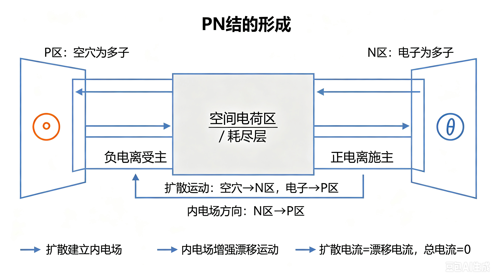

# PN结知识点总结

> 适用：南方科技大学 808 电子科学与技术综合  
> 考纲要求：PN结的形成、PN结的伏安特性、PN结的单向导电性能  
> 参考教材：童诗白、华成英《模拟电子技术基础》第四版，第1章 半导体二极管及其基本电路

---

## 学习目标

本章重点掌握以下内容：

1. PN结的形成过程及热平衡条件；
2. 正向偏置、反向偏置下耗尽层宽度和电流的变化规律；
3. PN结单向导电性的物理本质；
4. 肖克莱方程及其近似应用；
5. 反向击穿的类型与区别；
6. 势垒电容、扩散电容的形成原因与偏置特性。

---

## 1. 半导体预备知识

### 1.1 P型半导体

P型半导体是在本征半导体中掺入**受主杂质**形成的。

- 多数载流子：**空穴**；
- 少数载流子：自由电子；
- 受主杂质原子接受电子后，形成带负电的电离受主离子；
- 半导体整体仍然保持**电中性**。

### 1.2 N型半导体

N型半导体是在本征半导体中掺入**施主杂质**形成的。

- 多数载流子：**自由电子**；
- 少数载流子：空穴；
- 施主杂质原子释放电子后，形成带正电的电离施主离子；
- 半导体整体仍然保持**电中性**。

> **注意：** P型半导体和N型半导体本身并不带电，二者的区别在于可移动载流子的种类和浓度不同。

---

## 2. PN结的形成

将P型半导体和N型半导体结合在一起，在交界面处会发生载流子的扩散运动，并逐渐形成空间电荷区。

### 2.1 扩散运动

由于P区和N区存在载流子浓度差：

- P区空穴浓度高，空穴向N区扩散；
- N区电子浓度高，电子向P区扩散。

扩散运动的结果是：

- P区一侧失去空穴，留下不能移动的**负电离受主**；
- N区一侧失去电子，留下不能移动的**正电离施主**。

### 2.2 空间电荷区与内电场

在交界面附近，形成一个由固定离子构成、几乎没有可移动载流子的薄层，称为：

- **空间电荷区**；
- 又称**耗尽层**。

空间电荷的存在会建立一个内电场，方向为：

\[
\vec E_i:\quad \text{N区} \rightarrow \text{P区}
\]

### 2.3 漂移运动

内电场会驱动少子发生漂移运动：

- P区少子电子向N区漂移；
- N区少子空穴向P区漂移。

### 2.4 热平衡PN结

当扩散运动和漂移运动达到动态平衡时：

- 扩散电流 = 漂移电流；
- 总电流 = 0；
- 耗尽层宽度保持稳定；
- 交界面存在内建电位差 \(V_{BI}\)。

### 2.5 PN结形成示意图

下图展示了PN结从载流子扩散、空间电荷区形成，到热平衡建立的基本过程。



---

## 3. PN结的单向导电性

单向导电性是PN结最核心的性质，也是二极管工作的物理基础。

### 3.1 正向偏置

正向偏置是指：

- P区接电源正极；
- N区接电源负极。

外加电场方向为P→N，会削弱内电场，因此：

- 耗尽层**变窄**；
- 扩散运动增强；
- 漂移运动相对减弱；
- 大量多子越过PN结，形成较大的正向电流。

正向电流明显增大的条件是外加电压超过开启电压：

- 硅PN结：约 \(0.6\sim0.7\,\text{V}\)；
- 锗PN结：约 \(0.2\sim0.3\,\text{V}\)。

### 3.2 反向偏置

反向偏置是指：

- P区接电源负极；
- N区接电源正极。

外加电场会增强内电场，因此：

- 耗尽层**变宽**；
- 多子扩散被强烈抑制；
- 只有少子漂移运动；
- 形成数值很小的**反向饱和电流 \(I_S\)**。

反向饱和电流具有以下特点：

- 在一定反向电压范围内几乎不随反向电压变化；
- 对温度非常敏感；
- 温度升高时，\(I_S\) 显著增大。

### 3.3 单向导电的本质

PN结单向导电性的本质是：

> 外加偏置电压改变耗尽层宽度，从而控制多子扩散运动。

正向偏置时，扩散占优势，电流较大；反向偏置时，扩散被抑制，只有很小的漂移电流。

### 3.4 正反向偏置对比示意图

下图对比了正向偏置和反向偏置下耗尽层宽度、载流子运动和电流大小的变化。


---

## 4. PN结的伏安特性

### 4.1 肖克莱方程

PN结的电流-电压关系可以用肖克莱方程描述：

\[
I=I_S\left(e^{\frac{V}{V_T}}-1\right)
\]

其中：

- \(I_S\)：反向饱和电流；
- \(V\)：外加电压，正向为正，反向为负；
- \(V_T=\frac{kT}{q}\)：热电压；
- 室温下，\(V_T\approx26\,\text{mV}\)。

### 4.2 正向偏置近似

当正向电压远大于热电压时：

\[
V \gg V_T
\]

此时：

\[
e^{\frac{V}{V_T}} \gg 1
\]

因此：

\[
I \approx I_S e^{\frac{V}{V_T}}
\]

这说明正向电流随电压呈指数增长。

### 4.3 反向偏置近似

当反向电压满足：

\[
|V| \gg V_T
\]

此时：

\[
e^{\frac{V}{V_T}} \approx 0
\]

因此：

\[
I \approx -I_S
\]

即反向电流近似等于反向饱和电流。

### 4.4 伏安特性曲线

下图分别展示了正向指数上升、反向饱和以及反向击穿三个区域。


---

## 5. PN结的反向击穿

当反向电压增大到某一临界值时，反向电流会急剧增大，这种现象称为**反向击穿**。

### 5.1 雪崩击穿

雪崩击穿通常发生在反向电压较高的情况下。

- 少子在耗尽层中被强电场加速；
- 载流子获得足够能量后发生碰撞电离；
- 产生新的电子-空穴对；
- 新载流子继续参与碰撞，形成倍增效应。

雪崩击穿电压具有正温度系数：

- 温度升高，击穿电压增大。

### 5.2 齐纳击穿

齐纳击穿通常发生在重掺杂PN结中。

- 重掺杂使耗尽层很薄；
- 反向电压不高时，耗尽层内已经存在很强电场；
- 强电场直接将共价键中的电子拉出，形成隧穿电流。

齐纳击穿电压具有负温度系数：

- 温度升高，击穿电压略有下降。

### 5.3 击穿与损坏的区别

反向击穿并不一定意味着器件永久损坏。

- 若电路中有限流措施，击穿过程可以是可逆的；
- 若反向电流过大，导致器件过热，则会发生**热击穿**，造成永久性损坏。

---

## 6. PN结的结电容

PN结不仅具有电阻效应，还具有电容效应。在高频电路和开关电路中，结电容不可忽略。

PN结的总结电容为：

\[
C_j=C_B+C_D
\]

其中：

- \(C_B\)：势垒电容；
- \(C_D\)：扩散电容。

### 6.1 势垒电容 \(C_B\)

势垒电容来源于耗尽层的空间电荷效应。

- 耗尽层中的正负空间电荷相当于电容器的两个极板；
- 耗尽层宽度相当于介质厚度；
- 反向电压越大，耗尽层越宽，势垒电容越小。

因此：

- 势垒电容在**反向偏置**时起主要作用；
- 变容二极管正是利用反偏电压改变势垒电容。

### 6.2 扩散电容 \(C_D\)

扩散电容来源于正向导通时非平衡少子的存储效应。

- 正向偏置时，P区和N区分别注入大量非平衡少子；
- 这些非平衡少子形成一定的存储电荷；
- 外加电压变化时，存储电荷随之变化，表现为电容效应。

因此：

- 扩散电容在**正向偏置**时显著；
- 反向偏置时，扩散电容几乎可以忽略。

### 6.3 结电容示意图

下图分别说明了势垒电容与反向耗尽层宽度的关系，以及扩散电容与正向少子存储的关系。


---

## 7. PN结的温度特性

温度变化会显著影响PN结的工作特性。

### 7.1 正向压降

温度升高时，PN结的正向导通电压会下降。

近似关系为：

\[
\frac{dV_F}{dT}\approx -2\,\text{mV/℃}
\]

即温度每升高1℃，正向压降约减小2mV。

### 7.2 反向饱和电流

温度升高会使本征激发增强，少数载流子浓度增大，因此：

- 反向饱和电流 \(I_S\) 指数增大。

这也是温度升高时二极管反向电流明显增大的重要原因。

### 7.3 击穿电压

不同击穿类型的温度系数不同：

- 雪崩击穿电压：随温度升高而增大；
- 齐纳击穿电压：随温度升高而略有下降。

---

## 8. 知识结构图

```text
PN结
├─ 形成
│  ├─ 扩散运动
│  ├─ 空间电荷区 / 耗尽层
│  ├─ 内电场
│  ├─ 漂移运动
│  └─ 热平衡：扩散电流 = 漂移电流
├─ 单向导电性
│  ├─ 正向偏置：耗尽层变窄，电流较大
│  └─ 反向偏置：耗尽层变宽，电流很小
├─ 伏安特性
│  ├─ 肖克莱方程
│  ├─ 正向指数增长
│  └─ 反向近似饱和
├─ 反向击穿
│  ├─ 雪崩击穿
│  ├─ 齐纳击穿
│  └─ 热击穿：永久损坏
└─ 结电容
   ├─ 势垒电容 CB：反偏为主
   └─ 扩散电容 CD：正偏为主
