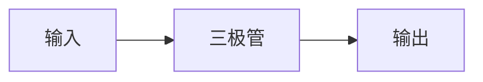

# assets · 图片附件（可选）

**纯 Markdown 原则下，图示优先用 Mermaid 代码块绘制**——GitHub 原生渲染、纯文本、可 diff、无需上传图片：

````markdown

````

只有 Mermaid 画不出来的内容（手写推导照片、教材原图）才放进本目录：

```
assets/
├── 数学/   英语/   模电/   数电/   政治/
```

**命名**：`<笔记名>-<序号>.png`，如 `assets/模电/共射放大电路-1.png`

**引用**（从笔记所在位置算相对路径）：

```markdown

```

**提醒**：手机拍照请先压缩到 300 KB 以内，避免仓库体积膨胀；教材扫描件与机构讲义请勿上传（见根目录 README 的版权说明）。
